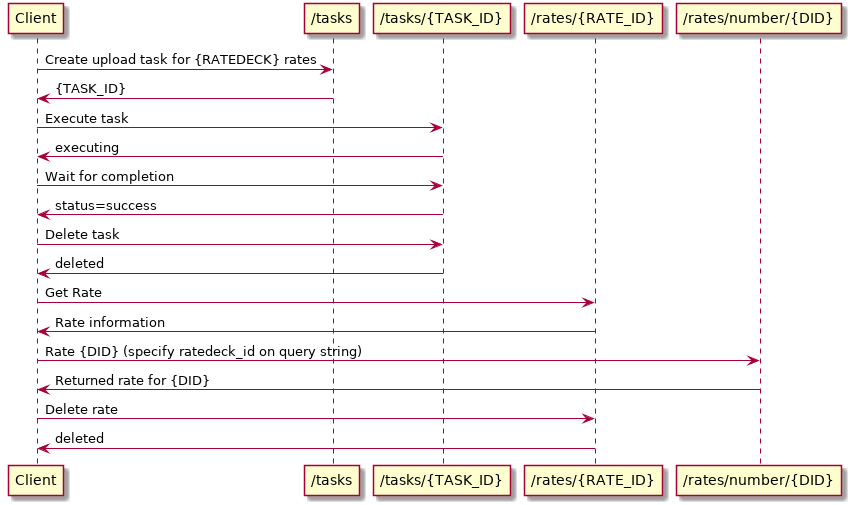
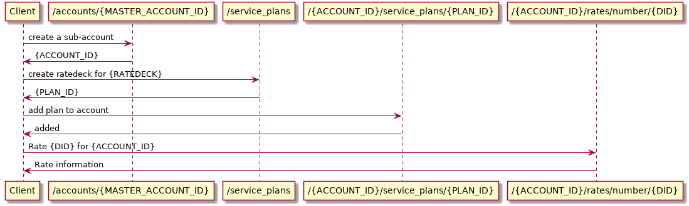

# Testing rates and ratedecks

## Goal: create multiple ratedecks, assign rates in each, and verify the correct rate is chosen when rating a DID.

The typical usage of the APIs to accomplish this:

## Goal: test service plans to assign a ratedeck to an account

Assuming the creation of ratedecks is working, test that creating a service plan for the ratedeck and assigning it to an account results in rating a DID within the account appropriately.

Note: as of this writing, creating new service plans in the master account is not doable via API. \`pqc\_cb\_service\_plans\` therefore cheats and accesses the database directly to add/remove the service plans for the ratedecks.

