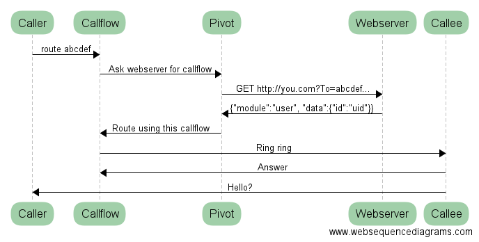

# Pivot


## About Myself

1.  About Myself

    -   James Aimonetti
        -   `Eye-Moe-Net-Tea`
        -   Commit to memory Patrick!
    -   Kazoo Architect and Community at 2600Hz
    -   mc\_ on freenode

2.  Presenter

    <div class="org-center">
    
    </div>


## High-level

-   Point a callflow at your server
-   Process the call against your business logic
-   Return Kazoo callflow JSON


## Flow




## Setting up Kazoo

-   create a callflow
-   set the pivot action as the child
-   set the URL to your web server and script

```shell
curl -X PUT \
-H "x-auth-token: {AUTH_TOKEN}" \
-H "content-type: application/json" \
-d '{"data":{
  "numbers":["12345"]
  ,"flow":{
    "module":"pivot"
    ,"data":{
      "voice_url":"http://your.server/pivot.php"
    }
  }
 }
}' \
http://crossbar:8000/v2/accounts/{ACCOUNT_ID}/callflows
```

Pivot will attempt to reach your server for calls to that callflow.


## The Request

-   GET - query string parameters
-   POST - x-www-form-urlencoded request body


## Common Request Fields

| Name             | Description       |
|---------------- |----------------- |
| Call-ID          | SIP Call-ID field |
| Request          | SIP Request user  |
| To               | SIP To user       |
| From             | SIP From user     |
| Account-ID       | Kazoo Account ID  |
| Caller-ID-Name   | CID Name          |
| Caller-ID-Number | CID Number        |


## Other Request Fields

| Name     | Description                           |
|-------- |------------------------------------- |
| Digits   | DTMFs (or collections) received       |
| User-ID  | Owner ID(s) of the calling device     |
| Language | Configured by the device/user/account |


## Create a handler

-   Create the script that Pivot will call
-   Process and build the Kazoo callflow JSON
-   Set **Content-Type** to **application/json**
-   Return the JSON as the body of the HTTP response


## Let's Build something!

<div class="org-center">
Example Time!
</div>


## Say something

-   Uses [FreeSWITCH `mod_flite`](https://freeswitch.org/confluence/display/FREESWITCH/mod_flite) by default
-   Supports [iSpeech](http://www.ispeech.org/text.to.speech) and [VoiceFabric](https://voicefabric.ru/) as alternatives


## Say Hi to the caller


## Play an MP3 to the caller


## Bridging the caller to a user

Bridge to:

-   [Device](https://github.com/2600hz/kazoo/blob/master/applications/crossbar/priv/couchdb/schemas/callflows.device.json)s (SIP, CallFwd, WebRTC)
-   [Users](https://github.com/2600hz/kazoo/blob/master/applications/crossbar/priv/couchdb/schemas/callflows.user.json)
-   [Ring Groups](https://github.com/2600hz/kazoo/blob/master/applications/crossbar/priv/couchdb/schemas/callflows.ring_group.json)
-   [Conferences](https://github.com/2600hz/kazoo/blob/master/applications/crossbar/priv/couchdb/schemas/callflows.conference.json) (Pre-defined or ad-hoc)
-   and more!


## Bridging the caller to a carrier

-   Toggle between local and global resources
-   Statically define a number to dial out to
-   See the [schema](https://github.com/2600hz/kazoo/blob/master/applications/crossbar/priv/couchdb/schemas/callflows.resources.json) for all the **data** options


## Collecting DTMF

First, collect the DTMF


## Collecting DTMF

A followup HTTP request will be sent to `http://pivot.your.company.com/collected.php`

-   Request includes `Digits[custom_name]=1234`
-   DTMF can either come as a basic string (if no custom name is used) or an array.
-   Let's see how to process them.


## Collecting DTMF


## Sending Presence Updates

Send custom presence updates

-   Some IoT devices/appliances can process SIP NOTIFY
-   `presence_id` can be **name** or **name@realm**
-   `status` can be **idle**, **ringing**, or **busy**


## Callflow actions

1.  Bridging

    -   Device
    -   User
    -   Group
    -   Resource
    -   Conference
    -   Voicemail Box
    -   Fax Box

2.  Caller ID

    -   Statically set Caller ID
    -   Dynamically set Caller ID
    -   Prepend Caller ID
    -   Routing via Whitelist or Regex of Caller IDs


## Callflow actions (cont)

1.  Features

    -   Eavesdrop
    -   Group Pickup
    -   Intercept
    -   Page Groups
    -   Hotdesk

2.  Miscellaneous

    -   Toggle call forwarding
    -   Toggle Do Not Disturb
    -   Directory services
    -   DISA
    -   Detect incoming fax
    -   Menus
    -   Custom Webhook


## Brainstorm

1.  Possible Integrations

    -   Calendars (Office365, Google, etc)
    -   Put received media (vm, fax) into services (storage, chat)
    -   Ad-driven, free calling?
    -   Digital assistants
    -   IVR Analytics (track stats as callers progress)
    -   CRM/Salesforce access
    -   Combine with metaflows and webhooks: call queues
    -   **Your Ideas?**


## What's Next?

1.  In Progress

    -   Building automated doc generation
    -   Continuing to add callflow actions

2.  How can you help?

    -   Build, build, build!
    -   Blog, blog, blog!
    -   Contribute to the docs effort
        -   Take ref docs and create/update the **real** docs


# Thank You